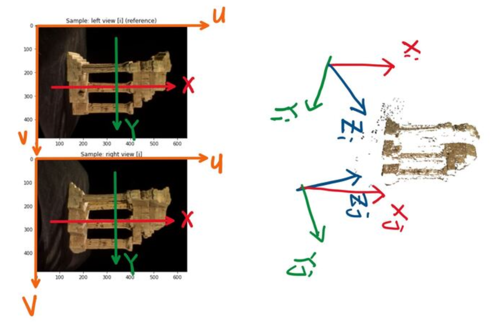
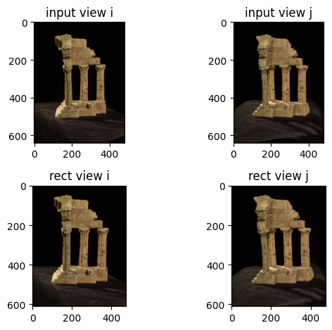
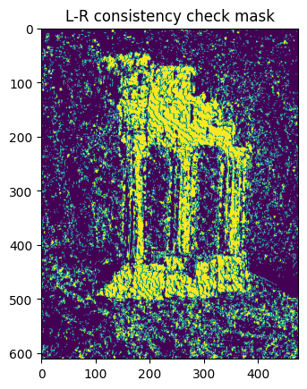
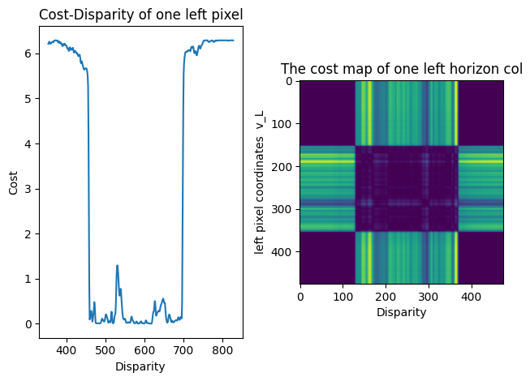
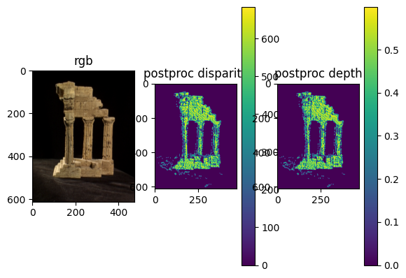

  

    <h1 align="center">TWO View Stereo 3D Reconstruction</h1>

## Introduction
This is the part of course CIS580 Machine Perception by Prof. Kostas Danidillis at University of Pennsylvania. The Two View Stereo Reconstruction project was a comprehensive exercise in 3D scene reconstruction from stereo images, involving detailed steps to accurately transform two-dimensional views into a three-dimensional model. The project encompassed the following detailed processes:

### 1. Camera Configuration and Coordinate Transformation: 

Initially, the focus was on understanding and setting up the camera configuration. This involved a detailed examination of how to transform coordinates from the world frame to the camera frame, which is essential for aligning and comparing different viewpoints of the same scene.

  

### 2. Image Rectification: 
A critical step was computing the rectification rotation matrix for the left and right camera views. This process aligned the two views on a common image plane and correspondences to on a horizontal epipolar line, making it easier to compare and compute disparities between them. It required a detailed understanding of stereo geometry and the intrinsic and extrinsic parameters of the camera setup.

  

### 3. Disparity Map Computation: 
An essential part of the project was the computation of disparity maps between the rectified images. This involved extracting image patches and computing similarity metrics like Sum of Squared Differences (SSD), Sum of Absolute Differences (SAD), and Zero-mean Normalized Cross-Correlation (ZNCC). Additionally, a Left-Right consistency check was implemented to enhance the accuracy of disparity estimation.

  

### 4. Depth Map and Point Cloud Generation: 

Using the computed disparity map, a depth map was generated. Each pixel's depth information was used to create a point cloud representing the scene's 3D structure. This process required back-projecting the 2D image points into 3D space using the camera's intrinsic parameters and the computed disparities.

  

### 5. Post-Processing for Enhanced Accuracy: 
The project also involved significant post-processing work. This included removing the background to isolate the subject of interest, cropping the depth map to focus on the relevant area, and applying filters to remove outliers from the point cloud. The resulting point cloud was then transformed back from the camera frame to the world frame, providing a coherent 3D representation of the scene.

  

### Visualization and Analysis:
Finally, the project included the visualization of the computed depth map and the reconstructed 3D point cloud. This step was crucial for analyzing the accuracy and quality of the reconstruction and for understanding the effectiveness of the implemented algorithms.

  

---

##  License

This project is protected under the [MIT] License. For more details, refer to the [LICENSE](https://choosealicense.com/licenses/mit/) file.

---

